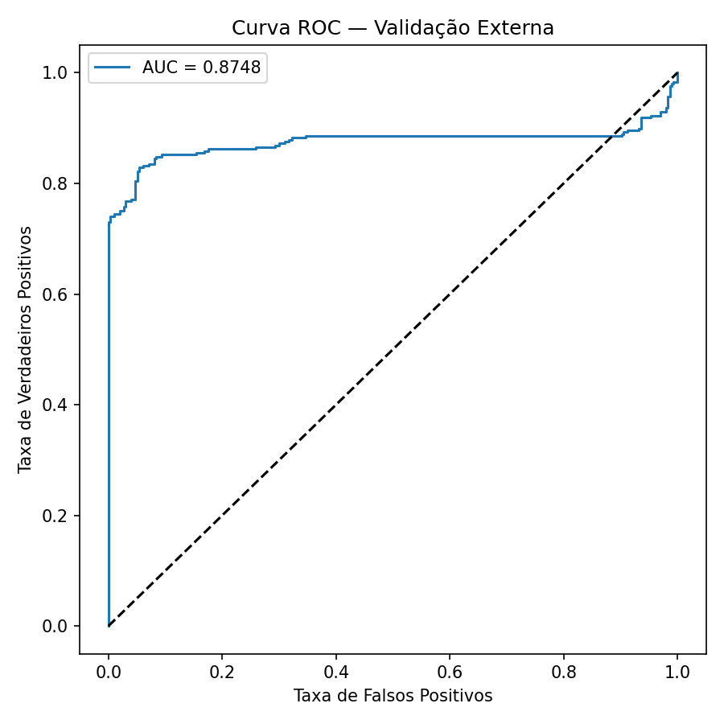

# Autoencoder para detecção de anomalias em vibração

Detecção de anomalias em sinais de acelerômetro com autoencoders em TensorFlow/Keras,
com dashboards web que mostram as métricas em tempo real.

O projeto tem duas partes:

- **`main.py`** — treina um autoencoder com sequências de vibração de helicóptero
  (só voos normais), define o limiar de anomalia e avalia numa validação rotulada.
  Dashboard em `http://localhost:8050`.
- **`sensor_app.py`** — monitor para um sensor de vibração real (ESP32 + ADXL345 pela
  serial), um simulador com falhas injetáveis ou uma gravação. Calibra com a máquina
  em operação normal e detecta anomalias ao vivo. Interface em
  `http://localhost:8060/sensor.html`.

## Instalação

Testado com Python 3.12 e TensorFlow 2.21.

```powershell
py -3.12 -m venv .venv312
.\.venv312\Scripts\python.exe -m pip install -r requirements.txt
```

O CPU é suficiente: o treino leva ~1 s por época e a inferência do sensor ~3 ms por
janela. Para GPU no Windows é preciso WSL2 (`run_wsl.sh`).

## Dados (não versionados)

Os dados são o *Airbus Helicopter Accelerometer Dataset* em CSV — sequências de 1 min
a 1024 Hz (61.440 amostras). Coloque na raiz do projeto:

| Arquivo | Conteúdo |
|---|---|
| `train_df.csv` | 1.677 sequências, todas normais |
| `validation_df.csv` | 594 sequências para avaliação |
| `dfvalid_groundtruth.csv` | rótulos da validação (`seqID`, `anomaly`): 297 normais, 297 anômalas |

Em cada CSV a primeira coluna é o índice da linha. Na primeira execução o `main.py`
converte os CSVs para `.npy` (~1 min); depois disso eles carregam em menos de 1 s.

## Treino e avaliação — `main.py`

```powershell
.\.venv312\Scripts\python.exe main.py
```

1. Separa 80 % das sequências normais para treino e 20 % como validação interna
   (early stopping e taxa de falsos positivos).
2. Normaliza cada amostra por min-max e treina um autoencoder denso
   (61.440 → 64 → 32 → 16 → 8 → … → 61.440) com perda MAE.
3. Limiar = μ + 3·σ do erro de reconstrução no treino.
4. Avalia na validação externa com os rótulos do `dfvalid_groundtruth.csv`.

O dashboard acompanha etapas, épocas, loss, learning rate, distribuição do erro,
matriz de confusão e curva ROC. As figuras também são salvas em PNG.

**Resultado da última execução** (limiar μ + 3·σ):

| Métrica | Valor |
|---|---|
| Falsos positivos na validação interna (336 normais) | 1,2 % |
| ROC-AUC na validação externa | 0,873 |
| Precisão / recall (anomalia) | 1,000 / 0,542 |



## Monitor de sensor — `sensor_app.py`

```powershell
.\.venv312\Scripts\python.exe sensor_app.py --sim           # simulador
.\.venv312\Scripts\python.exe sensor_app.py --serial COM3   # sensor real
```

1. **Conectar** a fonte: serial, simulador ou gravação.
2. **Calibrar** com a máquina em operação normal (2–5 min). Cada janela de 1 s vira
   features de energia em 64 faixas de frequência + RMS, pico, fator de crista e curtose
   por eixo. Um autoencoder aprende essas features e o limiar é μ + k·σ do erro nos
   últimos 20 % da gravação.
3. **Monitorar**: é anomalia quando 3 das últimas 5 janelas passam do limiar. A interface
   mostra também as faixas de frequência que mais se desviaram.

As calibrações ficam em `calibrations/` e as gravações em `recordings/`.

### Hardware

O firmware de referência para ESP32 + ADXL345 está em
[`firmware/esp32_adxl345`](firmware/esp32_adxl345/esp32_adxl345.ino), com o esquema de
ligação no cabeçalho do arquivo. Qualquer placa serve se enviar pela serial o cabeçalho
`# fs=1600 channels=x,y,z` e uma linha `x,y,z` por amostra, a taxa fixa.

## Estrutura

```
main.py              treino e avaliação (dataset Airbus)
sensor_app.py        monitor de sensor: aquisição, calibração e detecção
sensor_sources.py    fontes: serial, simulador, gravação
vibration.py         features, autoencoder e perfis de calibração do sensor
dashboard.py         servidor HTTP + Server-Sent Events e callbacks Keras
venv_guard.py        reinicia os scripts no .venv312 se o Python atual não tiver as dependências
frontend/            páginas dos dashboards (JavaScript + Chart.js)
firmware/            firmware de referência do sensor
run_wsl.sh           execução com GPU no WSL2
```
